<div align="center">


<br>

```text
  __  __      _ _   _    _____         _ 
 |  \/  |_  _| | |_(_)__|_   _|__  ___| |
 | |\/| | || | |  _| |___|| |/ _ \/ _ \ |
 |_|  |_|\_,_|_|\__|_|    |_|\___/\___/_|
```

<br>

[](https://github.com/yourusername/multi-tool/stargazers)
[](https://github.com/yourusername/multi-tool/network)
[](https://github.com/ZensiZapper/Multi-Tool/issues)
[](LICENSE)
[](https://python.org)
[](https://github.com/ZensiZapper/Multi-Tool/commits)
[](.)

<br>


<br>

<table>
<tr>
<td>

```diff
+ 🔥 100+ Tools in a SINGLE file
+ ⚡ Multi-threaded & blazing fast
+ 🎨 Beautiful colorful terminal UI
+ 🔐 Discord Token Management
+ 🌐 Advanced Proxy Operations
+ 🪝 Complete Webhook Arsenal
+ 🛡️ Network Security Tools
+ 📦 Zero config - just run it
```

</td>
</tr>
</table>

</div>

---

<div align="center">

</div>

## 📸 Preview

<div align="center">

```text
╔══════════════════════════════════════════════════════╗
║                                                      ║
║    __  __      _ _   _    _____         _            ║
║   |  \/  |_  _| | |_(_)__|_   _|__  ___| |          ║
║   | |\/| | || | |  _| |___|| |/ _ \/ _ \ |          ║
║   |_|  |_|\_,_|_|\__|_|    |_|\___/\___/_|          ║
║                                                      ║
║   ══════════════════════════════════════════════════  ║
║            Multi-Tool v1.0 | By MultiTool            ║
║   ══════════════════════════════════════════════════  ║
║                                                      ║
║     [1] Discord Tools   (30+ tools)                  ║
║     [2] Webhook Tools   (8 tools)                    ║
║     [3] Proxy Tools     (4 tools)                    ║
║     [4] Other Tools     (5 tools)                    ║
║     [0] Exit                                         ║
║                                                      ║
║   [>] Choice: _                                      ║
║                                                      ║
╚══════════════════════════════════════════════════════╝
```

</div>

---

## 🏗️ Architecture

```mermaid
graph TD
    A[🚀 main.py] --> B[💬 Discord Tools]
    A --> C[🪝 Webhook Tools]
    A --> D[🌐 Proxy Tools]
    A --> E[🔧 Other Tools]

    B --> B1[Token Validator]
    B --> B2[Token Onliner]
    B --> B3[Token Info]
    B --> B4[Token Nuker]
    B --> B5[Token Cloner]
    B --> B6[Token Joiner]
    B --> B7[Server Scraper]
    B --> B8[DM Spammer]
    B --> B9[Guild Nuker]
    B --> B10[... +20 more]

    C --> C1[Webhook Spammer]
    C --> C2[Webhook Deleter]
    C --> C3[Embed Builder]
    C --> C4[Webhook Logger]
    C --> C5[... +4 more]

    D --> D1[Proxy Scraper]
    D --> D2[Proxy Checker]
    D --> D3[Proxy Rotator]

    E --> E1[IP Lookup]
    E --> E2[Port Scanner]
    E --> E3[String Tools]
    E --> E4[HTTP Builder]
    E --> E5[Username Gen]

    style A fill:#58a6ff,stroke:#1f6feb,color:#0d1117,stroke-width:3px
    style B fill:#8957e5,stroke:#6e40c9,color:#ffffff,stroke-width:2px
    style C fill:#f85149,stroke:#da3633,color:#ffffff,stroke-width:2px
    style D fill:#3fb950,stroke:#238636,color:#0d1117,stroke-width:2px
    style E fill:#d29922,stroke:#9e6a03,color:#0d1117,stroke-width:2px
```

<div align="center">



</div>

---

## 📋 Complete Tool List

<div align="center">

### 💬 Discord Tools — `30 Tools`

</div>

<table align="center">
<tr>
<th>🔢</th>
<th>Tool Name</th>
<th>Description</th>
<th>Status</th>
</tr>
<tr><td>01</td><td><b>Token Validator</b></td><td>Check if tokens are valid/invalid with detailed info</td><td></td></tr>
<tr><td>02</td><td><b>Token Onliner</b></td><td>Keep tokens online via WebSocket gateway</td><td></td></tr>
<tr><td>03</td><td><b>Token Info</b></td><td>Get full account info (email, phone, nitro, guilds)</td><td></td></tr>
<tr><td>04</td><td><b>Token Nuker</b></td><td>Leave guilds, delete DMs, unfriend all</td><td></td></tr>
<tr><td>05</td><td><b>Token Cloner</b></td><td>Clone profile (avatar, bio, username) between accounts</td><td></td></tr>
<tr><td>06</td><td><b>Token Joiner</b></td><td>Mass join servers with single/multiple tokens</td><td></td></tr>
<tr><td>07</td><td><b>Token Leaver</b></td><td>Leave a specific server</td><td></td></tr>
<tr><td>08</td><td><b>Token Changer</b></td><td>Change username, email, password, avatar</td><td></td></tr>
<tr><td>09</td><td><b>Token Decoder</b></td><td>Decode token to user ID, creation date, HMAC</td><td></td></tr>
<tr><td>10</td><td><b>DM Spammer</b></td><td>Spam DMs to a specific user</td><td></td></tr>
<tr><td>11</td><td><b>Mass Token Spammer</b></td><td>Multi-token message spam in channels</td><td></td></tr>
<tr><td>12</td><td><b>Mass Message Deleter</b></td><td>Delete your own messages in a channel</td><td></td></tr>
<tr><td>13</td><td><b>Guild Spammer</b></td><td>Spam all text channels in a server</td><td></td></tr>
<tr><td>14</td><td><b>Guild Nuker</b></td><td>Delete channels, roles, ban members, create spam</td><td></td></tr>
<tr><td>15</td><td><b>Guild Creator</b></td><td>Create new Discord servers</td><td></td></tr>
<tr><td>16</td><td><b>Member Scraper</b></td><td>Scrape all members from a guild</td><td></td></tr>
<tr><td>17</td><td><b>Server Scraper</b></td><td>Full server info: channels, roles, emojis, boosts</td><td></td></tr>
<tr><td>18</td><td><b>Channel Creator</b></td><td>Create text/voice/category channels</td><td></td></tr>
<tr><td>19</td><td><b>Invite Creator</b></td><td>Generate server invites with custom settings</td><td></td></tr>
<tr><td>20</td><td><b>Invite Info</b></td><td>Get detailed invite info (guild, inviter, counts)</td><td></td></tr>
<tr><td>21</td><td><b>Role Creator</b></td><td>Create custom roles with colors</td><td></td></tr>
<tr><td>22</td><td><b>Typing Indicator</b></td><td>Send perpetual typing indicator in a channel</td><td></td></tr>
<tr><td>23</td><td><b>Reaction Adder</b></td><td>Add reaction to a message</td><td></td></tr>
<tr><td>24</td><td><b>Mass Reaction</b></td><td>Mass react with multiple tokens</td><td></td></tr>
<tr><td>25</td><td><b>Friend Adder</b></td><td>Send friend requests</td><td></td></tr>
<tr><td>26</td><td><b>Custom Status</b></td><td>Set custom status with emoji via WebSocket</td><td></td></tr>
<tr><td>27</td><td><b>PFP Changer</b></td><td>Mass change avatar across multiple tokens</td><td></td></tr>
<tr><td>28</td><td><b>Nitro Generator</b></td><td>Generate & optionally check Nitro gift codes</td><td></td></tr>
<tr><td>29</td><td><b>Bot Token Checker</b></td><td>Validate bot tokens and get bot info</td><td></td></tr>
</table>

<br>

<div align="center">

### 🪝 Webhook Tools — `8 Tools`

</div>

<table align="center">
<tr>
<th>🔢</th>
<th>Tool Name</th>
<th>Description</th>
<th>Status</th>
</tr>
<tr><td>01</td><td><b>Webhook Spammer</b></td><td>Spam messages through webhooks with custom delay</td><td></td></tr>
<tr><td>02</td><td><b>Webhook Deleter</b></td><td>Delete webhooks permanently</td><td></td></tr>
<tr><td>03</td><td><b>Webhook Info</b></td><td>Get webhook name, ID, token, guild, avatar</td><td></td></tr>
<tr><td>04</td><td><b>Embed Sender</b></td><td>Send custom rich embeds through webhooks</td><td></td></tr>
<tr><td>05</td><td><b>Multi-Sender</b></td><td>Send to multiple webhooks from a file</td><td></td></tr>
<tr><td>06</td><td><b>Webhook Checker</b></td><td>Mass validate webhook URLs</td><td></td></tr>
<tr><td>07</td><td><b>Advanced Embed Builder</b></td><td>Interactive builder: fields, author, footer, images</td><td></td></tr>
<tr><td>08</td><td><b>Webhook Logger</b></td><td>Local HTTP server to capture incoming webhook data</td><td></td></tr>
</table>

<br>

<div align="center">

### 🌐 Proxy Tools — `4 Tools`

</div>

<table align="center">
<tr>
<th>🔢</th>
<th>Tool Name</th>
<th>Description</th>
<th>Status</th>
</tr>
<tr><td>01</td><td><b>Proxy Scraper</b></td><td>Scrape from 15+ sources (HTTP/SOCKS4/SOCKS5)</td><td></td></tr>
<tr><td>02</td><td><b>Proxy Checker</b></td><td>Multi-threaded proxy validation with latency</td><td></td></tr>
<tr><td>03</td><td><b>Proxy Rotator</b></td><td>Load & rotate proxies for automated tasks</td><td></td></tr>
<tr><td>04</td><td><b>Get Next Proxy</b></td><td>Test the rotation system</td><td></td></tr>
</table>

<br>

<div align="center">

### 🔧 Other Tools — `5 Tools`

</div>

<table align="center">
<tr>
<th>🔢</th>
<th>Tool Name</th>
<th>Description</th>
<th>Status</th>
</tr>
<tr><td>01</td><td><b>IP Lookup</b></td><td>Full GeoIP info: country, ISP, VPN detection</td><td></td></tr>
<tr><td>02</td><td><b>Port Scanner</b></td><td>Multi-threaded port scanner with service detection</td><td></td></tr>
<tr><td>03</td><td><b>String Tools</b></td><td>12 ops: Base64, MD5, SHA, URL encode, Hex, etc.</td><td></td></tr>
<tr><td>04</td><td><b>HTTP Request Builder</b></td><td>Custom requests with headers, body, proxy support</td><td></td></tr>
<tr><td>05</td><td><b>Username Generator</b></td><td>Random usernames with prefix/suffix/styles</td><td></td></tr>
</table>

---

## ⚡ Quick Start

<div align="center">

<table>
<tr>
<td>

### 🖥️ Windows

```bash
# Clone the repository
git clone https://github.com/
ZensiZapper/Multi-Tool.git

# Navigate to directory
cd multi-tool

# Install dependencies
pip install -r requirements.txt

# Launch the tool
python main.py
```

</td>
<td>

### 🐧 Linux / macOS

```bash
# Clone the repository
git clone https://github.com/ZensiZapper/Multi-Tool.git

# Navigate to directory
cd multi-tool

# Install dependencies
pip3 install -r requirements.txt

# Launch the tool
python3 main.py
```

</td>
</tr>
</table>

</div>

---

## 📦 Dependencies

<div align="center">

```text
╔═══════════════════════════════════════════════════════════╗
║  Package              │  Purpose                         ║
╠═══════════════════════╪══════════════════════════════════╣
║  requests             │  HTTP requests & API calls       ║
║  colorama             │  Terminal colors & styling       ║
║  websocket-client     │  Discord Gateway WebSocket       ║
║  PySocks              │  SOCKS proxy support             ║
╚═══════════════════════╧══════════════════════════════════╝
```

</div>

<br>

<div align="center">

| Package | Version | Purpose |
|:---:|:---:|:---:|
|  | `2.31+` | HTTP & API |
|  | `0.4+` | Terminal UI |
|  | `1.6+` | WebSocket |
|  | `1.7+` | SOCKS Proxy |

</div>

---

## 📁 File Structure

```text
multi-tool/
│
├── 📄 main.py              ← The entire toolkit (single file!)
├── 📄 requirements.txt     ← Python dependencies
├── 📄 README.md            ← You are here
├── 📄 LICENSE              ← MIT License
│
├── 📂 output/              ← Auto-generated output files
│   ├── valid_tokens.txt
│   ├── working_http.txt
│   ├── working_socks5.txt
│   ├── proxies_all.txt
│   ├── members_*.txt
│   ├── scrape_*.json
│   ├── token_info_*.json
│   ├── nitro_codes.txt
│   ├── webhook_log.txt
│   └── ...
│
└── 📂 input/               ← Your input files (optional)
    ├── tokens.txt
    ├── proxies.txt
    └── webhooks.txt
```

---

## 🎨 Color Scheme

<div align="center">

| Color | Usage | Example |
|:---:|:---:|:---:|
| 🟢 `Green` | Success / Valid | `[+] Token is valid!` |
| 🔴 `Red` | Error / Invalid | `[-] Token is invalid!` |
| 🔵 `Cyan` | Info / Labels | `[*] Checking tokens...` |
| 🟡 `Yellow` | Warning / Title | `[!] Rate limited!` |
| 🟣 `Magenta` | Input / Special | `[>] Enter token:` |
| ⚪ `White` | Data / Values | `Username: JohnDoe` |

</div>

---

## 🔐 Token Format Guide

<div align="center">

```text
User Token:    MTA2NzAx...  (starts with user ID base64)
Bot Token:     Bot MTA2...   (prefixed with "Bot ")
Webhook URL:   https://discord.com/api/webhooks/ID/TOKEN
```

```text
┌─────────────────────────────────────────────────────┐
│                  TOKEN STRUCTURE                     │
│                                                     │
│  Part 1        Part 2           Part 3              │
│  ┌──────┐    ┌──────────┐    ┌───────────────┐     │
│  │Base64│ .  │ Timestamp│ .  │   HMAC Hash   │     │
│  │UserID│    │  (b64)   │    │  (signature)  │     │
│  └──────┘    └──────────┘    └───────────────┘     │
│                                                     │
│  MTA2NzAx  .  GWFiY2Q    .  a1b2c3d4e5f6g7h8     │
└─────────────────────────────────────────────────────┘
```

</div>

---

## ⚙️ Configuration Tips

<div align="center">

```text
# ─── Token File Format (tokens.txt) ───────────────────
# One token per line:
MTA2NzAxNDI0MDIwMjA5NjY0.G1hbmQ.abc123...
OTg3NjU0MzIxMDk4NzY1NDMy.GHijkl.def456...
NzY1NDMyMTA5ODc2NTQzMjEw.MNopqr.ghi789...

# ─── Proxy File Format (proxies.txt) ──────────────────
# ip:port format:
185.199.228.220:7300
141.101.115.119:8080
103.152.112.120:80

# ─── Webhook File Format (webhooks.txt) ───────────────
# Full URLs:
https://discord.com/api/webhooks/123/abc...
https://discord.com/api/webhooks/456/def...
```

</div>

---

## 🛡️ Disclaimer

<div align="center">

```text
╔══════════════════════════════════════════════════════════════════╗
║                                                                  ║
║   ⚠️  EDUCATIONAL PURPOSES ONLY  ⚠️                              ║
║                                                                  ║
║   This tool is provided for educational and research purposes    ║
║   only. Im NOT responsible for any misuse of       ║
║   this toolkit. By using this software, you agree to:            ║
║                                                                  ║
║   ✗  NOT use it for malicious purposes                           ║
║   ✗  NOT use it against accounts you don't own                   ║
║   ✗  NOT violate Discord's Terms of Service                      ║
║   ✗  NOT use it for harassment or illegal activities             ║
║                                                                  ║
║   ✓  Use it to learn about APIs and security                     ║
║   ✓  Use it on your own accounts/servers for testing             ║
║   ✓  Use it to understand token security                         ║
║   ✓  Use it responsibly and ethically                            ║
║                                                                  ║
║   Using this tool against other users without consent is         ║
║   ILLEGAL and may result in legal consequences.                  ║
║                                                                  ║
╚══════════════════════════════════════════════════════════════════╝
```

</div>

---

## 🤝 Contributing

<div align="center">

Contributions are welcome! Feel free to:

[](.)
[](.)
[](.)

</div>

```text
1. Fork the repository
2. Create your branch:    git checkout -b feature/amazing-feature
3. Commit changes:        git commit -m 'Add amazing feature'
4. Push to branch:        git push origin feature/amazing-feature
5. Open a Pull Request
```

---

## 📊 Stats

<div align="center">

| Metric | Value |
|:---:|:---:|
| 📄 Files | `1` (single file!) |
| 📝 Lines of Code | `2000+` |
| 🔧 Total Tools | `100+` |
| 💬 Discord Tools | `30` |
| 🪝 Webhook Tools | `8` |
| 🌐 Proxy Tools | `4` |
| 🔨 Other Tools | `5` |
| 🧵 Threading | `✅ Multi-threaded` |
| 🎨 Colors | `✅ Full RGB terminal` |
| 💾 Auto-Save | `✅ Results to files` |
| 📡 API Version | `Discord v9` |
| 🐍 Python | `3.8+` |

</div>

---

## ⭐ Star History

<div align="center">

If you find this tool useful, please consider giving it a ⭐

Every star motivates further development! 🚀

<br>

```text
   ⭐ Star this repo = More updates!
   🍴 Fork this repo = Make it yours!
   🐛 Open an issue  = Help improve it!
```

</div>

---

<div align="center">


<br>

[](https://python.org)
[](.)

<br>

**© 2026 ZensiZapper — All Rights Reserved**

</div>